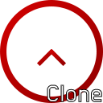
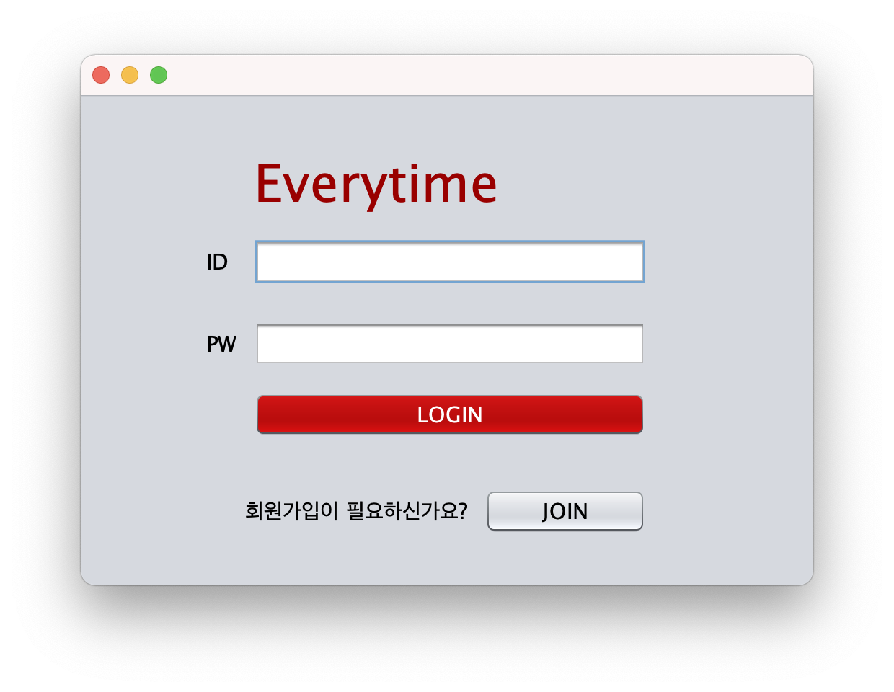

# JAVA-Everytime
Everytime(KR Univ-App) Clone Programming

<!-- PROJECT LOGO -->
<br />
<p align="center">
    
  </a>

  <h3 align="center">Everytime Clone Coding Project</h3>

  <p align="center">
    대학생 필수 애플리케이션, 에브리타임(Everytime)을 Java로 구현한 프로젝트입니다.</br>
    Essential application for Univ students, Everytime (Programming in Java)
  </p>
</br>


<!-- ABOUT THE PROJECT -->
## EveryTime Project is..


Java를 활용한 Design Pattern에 대한 학습을 위해 제작한 프로젝트.
한국의 대학생이 가장 많이 사용하는 어플리케이션인 Everytime을 사용자의 입장에서
분석하고, 설계 및 재구성 후 디자인 패턴을 적용하여 제작하였다.

**개발 목적:**
* Design Pattern의 적용
* 여러 기법을 통해 효율적인 Team Project 수행 방법 찾기


## IDE & Tools

Apache NetBeans IDE 12.1 환경에서 100% Java를 이용하여 구현하였다.
* 개발 언어(Programming Language) : [Java](https://www.java.com)
* 개발 툴(Programming Tools/IDE) : [Netbeans](https://netbeans.apache.org)
* 데이터베이스(Database) : [MySQL](https://www.mysql.com)


## How To Launch

*Database Server 사용 중지로 인해 프로그램이 실행되지 않을 수 있음.*
```markdown
1. Run NetBeans IDE (or Ather IDE) (Recommended : Apache NetBeans IDE 12.1)
2. Clone the repository (PULL)
3. Launch Everytime Program.
```


<!-- USAGE EXAMPLES -->
## Project Demo

실제 구현 사진 추가
